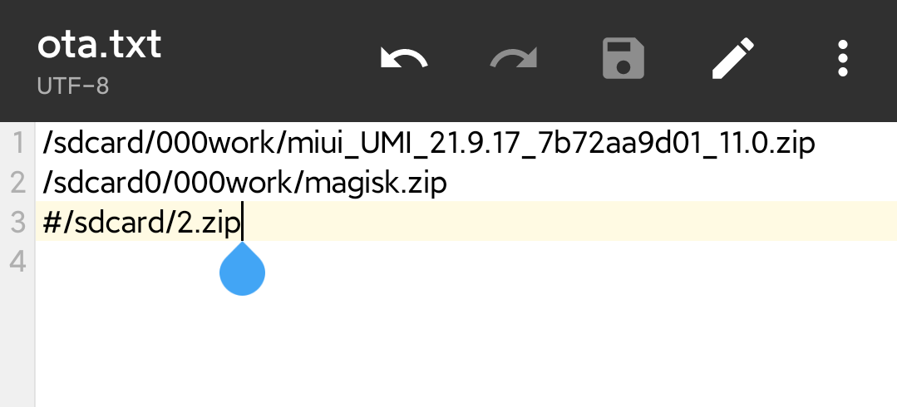
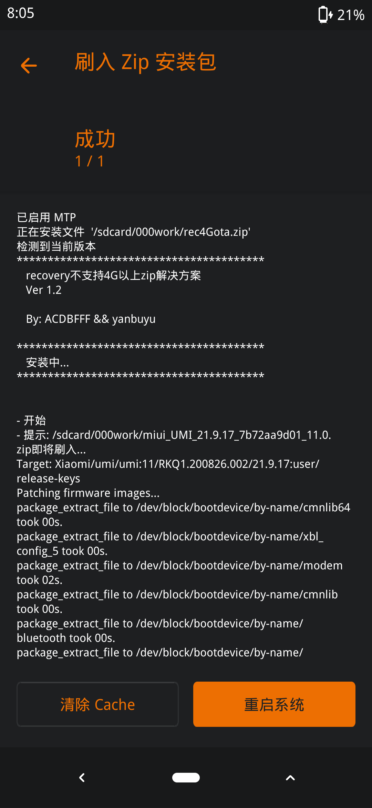
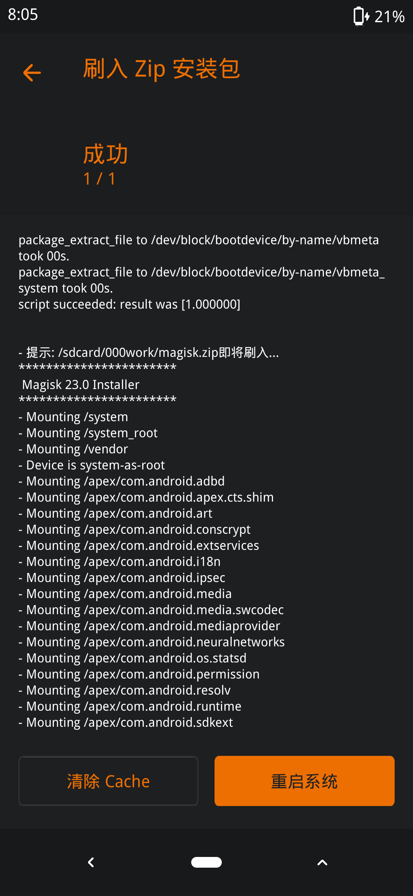

# rec4Gota


#### 灵感来源于[android/platform/bootable/recovery/f087dfb/./updater/updater.c](https://android.googlesource.com/platform/bootable/recovery/+/f087dfb/updater/updater.c)


#### 一个简单的小补丁，解决TWRP不能刷超过4G ROM的问题。


#### 更新日志：

1.3：支持usb-otg


***

### 用法：

#### 1.下载[rec4Gota](https://github.com/xiangfeidexiaohuo/rec4Gota/releases)卡刷补丁

#### 2.sdcard根目录或者otg设备根目录建立ota.txt，书写内容示例：
```
/sdcard/000work/miui_UMI_21.9.17_7b72aa9d01_11.0.zip
/sdcard/000work/magisk.zip

```


 * sdcard根目录的ota.txt优先级最高，若otg设备也存在ota.txt，只会读取sdcard里的ota.txt。

 * 若你要把ROM放在otg设备里，那么ota.txt书写内容示例：
```
/usb-otg/miui_UMI_21.9.17_7b72aa9d01_11.0.zip
/usb-otg/magisk.zip

```

**说明：**

 * 路径可自定义，但是必须是/sdcard/或者/usb-otg/下，不能出现中文目录。

 * 可用#注释不需要刷入的zip。

 * 仅支持arm64架构。

 * 若使用otg设备，请确认在twrp下，otg设备的路径为/usb-otg/，某些私人订制的twrp可能不是这个路径，那么不支持！

#### 3.重启进入twrp，刷入该补丁：[rec4Gota](https://github.com/xiangfeidexiaohuo/rec4Gota/releases)，就会一起刷入ota.txt路径里的ROM/补丁。





遇到挂载失败，重启twrp！


***

### 贡献

[SK](https://github.com/sekaiacg)

[yanbuyu](https://github.com/yanbuyu)


